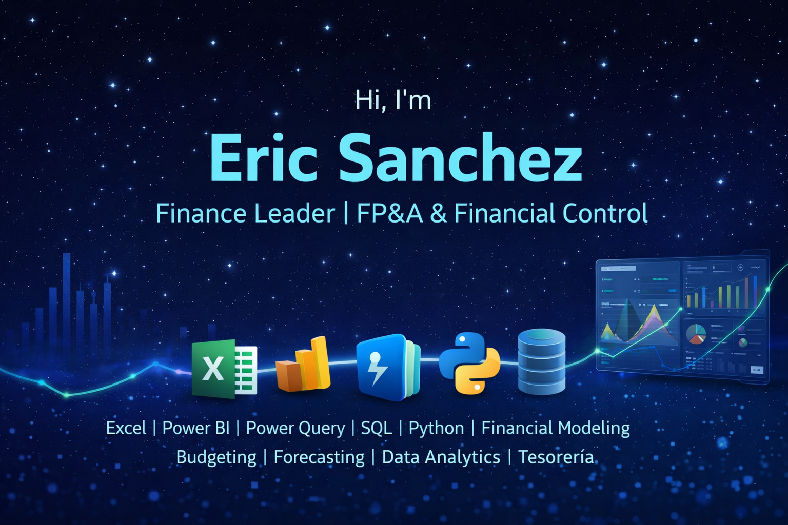

<!-- Banner (opcional) -->

  

# 👋 Hi there, I'm Eric Sanchez

**Finance & Administrative Leader | FP&A Manager | Financial Control Specialist**

11+ years driving financial & administrative transformations in multinational organizations.
Specialist in financial planning, administrative management, budget control, process automation & data-driven insights.

---

## 🚀 About Me

- **📍 Based in:** Bogotá, D.C., Colombia (Hybrid/Remote)
- **💼 Current Focus:** FP&A Leadership | Financial Control | Administrative Management | Strategic Planning
- **🎓 Background:** Business Administration + Data Analytics (Henry Bootcamp, 2025)
- **💪 Core Strengths:** 
  - 80% debt reduction through financial modeling & restructuring
  - 70% reduction in reporting/operational times via automation
  - 15% cost optimization through process improvement & analysis
  - Executive dashboard development & KPI management
  - Cross-functional team leadership & stakeholder management

---

## 💼 What I Do

### Finance Leadership
- Develop integrated financial models for forecasting, scenario analysis & variance analysis
- Design & automate dashboards in Power BI | Excel | Power Query
- Build executive reports & presentations for C-level decision-making
- Lead budget planning, cash flow management, tesorería & KPI monitoring
- Control presupuestal, forecasting & financial performance analysis

### Administrative Management
- Lead administrative & financial operations at organizational level
- Design & implement administrative processes & policies
- Manage HR support, contracts administration & SLAs monitoring
- Optimize operational workflows & improve efficiency
- Support vendor management, procurement & internal controls
- Ensure compliance & governance in financial & administrative areas

### Process Automation & Optimization
- Automated 70% of financial & administrative reporting processes
- Standardized reconciliation procedures (bank, A/P, A/R, assets)
- Designed ETL pipelines for data consolidation across departments
- Implemented continuous improvement frameworks in operations
- Led organizational restructuring & efficiency initiatives

### Data-Driven Leadership
- Analyze financial & operational performance | variances | trends
- Support strategic decisions with insightful data analysis
- Bridge finance, operations & administration through collaboration
- Develop KPIs & performance indicators for organizational excellence

---

## 🛠️ Languages & Tools

**Finance & Analysis:**

**Data & Programming:**

**Data Visualization & Tools:**

**ERPs & Platforms:**

---

## 💼 Portfolio

| # | Project Name | Description | Stack | Repository |
|---|---|---|---|---|
| **P1** | 📊 Retail Sales Data Cleaning & Insights (FactSales) | ETL pipeline for retail data consolidation, cleaning & analysis with insights generation | Excel + Power Query | [excel-cleaning-insights-retail](https://github.com/ESanchezSalas/excel-cleaning-insights-retail) |
| **P2** | 📈 Operations Dashboard (Sales/KPIs) | Real-time operational metrics tracking with ETL automation & interactive visualizations | Google Sheets (ETL + Viz) | [google-sheets-ops-dashboard](https://github.com/ESanchezSalas/google-sheets-ops-dashboard) |
| **P3** | 🍔 Fast Food Analytics Database | Operational KPI reporting system with financial analysis & performance tracking | SQL Server + T-SQL | [sqlserver-fastfood-analytics](https://github.com/ESanchezSalas/sqlserver-fastfood-analytics) |
| **P4** | 💰 Sales Dashboard - AdventureWorks | Multi-dimensional sales analysis dashboard with revenue, COGS & profitability metrics | Power BI + SQL | [powerbi-adventureworks-sales-dashboard](https://github.com/ESanchezSalas/powerbi-adventureworks-sales-dashboard) |
| **P5** | 🦠 COVID-19 Data Analysis & Visualization | Large-scale comparative analysis across Latin American regions with trend insights | Python (pandas, matplotlib) + Power BI | [covid-analytics-python-powerbi](https://github.com/ESanchezSalas/covid-analytics-python-powerbi) |
| **P6** | 📦 Predictive Inventory Optimization | Machine Learning model for demand forecasting & inventory level optimization | Python (pandas, scikit-learn) + SQL + Power BI | [inventario-predictivo](https://github.com/ESanchezSalas/inventario-predictivo) |

---

## 💡 Relevant Experience

✅ **Financial & Administrative Leadership**
- Led administrative & financial operations at national level (Necomplus, 6 years)
- Managed organizational restructuring & optimization initiatives
- Supervised administrative teams & cross-functional coordination
- Ensured compliance & governance in all financial & administrative matters

✅ **Report Automation & Process Optimization**
- Automated 70% of financial & administrative reporting processes
- Designed ETL pipelines for data consolidation & unification
- Standardized procedures: bank reconciliations, A/P, A/R, asset controls
- Implemented continuous improvement frameworks

✅ **Financial & Administrative KPIs**
- Built executive dashboards for strategic decision-making
- Designed KPI frameworks for operational & financial monitoring
- Implemented SLA compliance tracking & performance indicators
- Cash flow management, budget control & forecasting

✅ **Operational & Financial Control**
- Budget planning & forecasting | AP/AR management | Bank reconciliation
- Variance analysis & financial performance monitoring
- Treasury management | Vendor management | Contract administration
- Internal audit & compliance verification

---

## 🎓 Education & Certifications

**Bootcamp Data Analytics** — Soy Henry (May 2025 – Sep 2025)
- Excel | Power Query | Power BI | SQL | Python (pandas, NumPy, matplotlib, seaborn)

**Business Administration** — Universidad Colegio Mayor de Cundinamarca (2013 - 2016)

**Technology in Managerial Assistance** — Universidad Colegio Mayor de Cundinamarca (2010 - 2012)

**Certifications:**
- ✅ AI Applied to Finance (Edutin Academy, 2026)
- ✅ Snowflake SQL (DataCamp, 2025)
- ✅ SQL TOTAL (Udemy, 2025)
- ✅ Advanced Excel & Dashboards (INTECAP, 2023)
- ✅ English B2 Upper Intermediate (Kaplan, London, 2023)

---

## 📫 Contact & Links

**📧 Email:** [erics1591@hotmail.com](mailto:erics1591@hotmail.com)  
**🔗 LinkedIn:** [linkedin.com/in/ericsanchezsalas](https://linkedin.com/in/ericsanchezsalas)  
**📱 Phone:** +57 324 6880356  
**📍 Location:** Bogotá, Colombia 🇨🇴  

---

## 🎯 I'm Open To

- **FP&A Manager** | **Finance Manager** | **Financial Controller** roles
- **Gerente Administrativo y Financiero** | **Administrative & Finance Director** positions
- **Finance & Operations Leadership** opportunities
- **Coordinador Administrativo y Financiero** roles
- **Fintech/Tech Finance** opportunities in LATAM
- **Data-Driven Finance** projects with operational impact
- **Mentorship** in finance, data analytics & business administration

---

*"Combining financial expertise with administrative excellence to drive organizational growth."* 📊💼

---

**Last Updated:** April 2026
